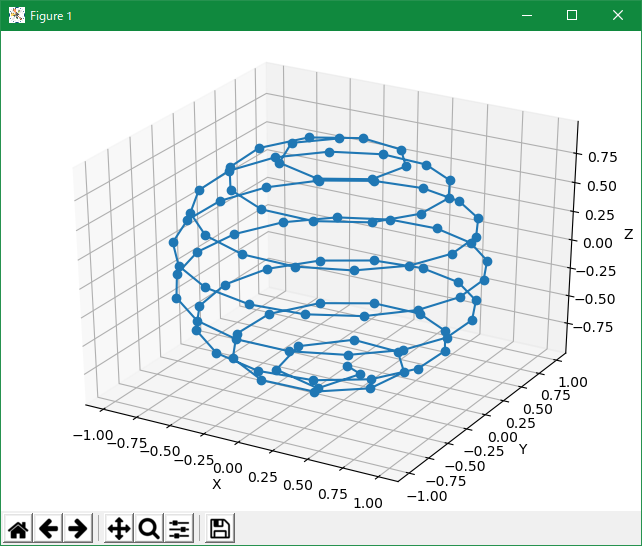

# SphereDist by katahiromz

SphereDist is a program and a library of C++ that realize equal distance distribution of vertexes on a sphere or a hemisphere.

License: MIT

Thanks to Atsushi Yamaji (Kyoto Univ.) for algorithm.

See also (Japanese):
[https://www.jstage.jst.go.jp/article/geoinformatics/12/1/12_1_3/_article/-char/ja/](https://www.jstage.jst.go.jp/article/geoinformatics/12/1/12_1_3/_article/-char/ja/)
